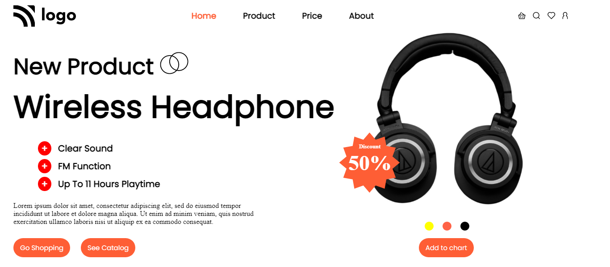

# Electronic Products Landing Page

**Hi everyone, I am Raushan.**

This project is a landing page of a electronic product website coded purely in HTML and CSS😎.

> This one is a very unique landing page as it uses images and text content very intermingingly, so the use of CSS Position and Flexbox was done very carefully to not mishandle the images. Navbar was relatively simple to handle by the main section was very delicately coded using `flexbox` and `positions` 💪.

- Learnings from the project are as follows:
    - Using text over an svg image using `z-index`
    - different `flexbox` properties
    - `positions` for image positioning

>This project was relatively harder than few last projects and it took around 2.5 hours to complete it. However, it was much fun😉.

Below is the link and view of the project👇👇👇
 

